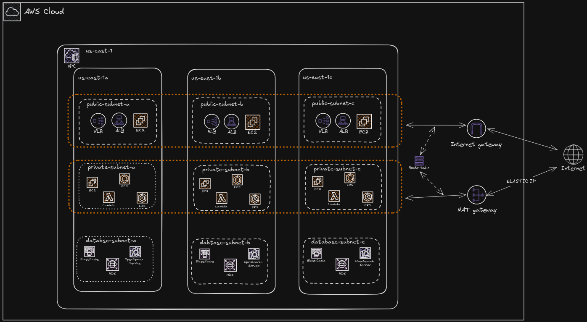

# AWS VPC com Terraform

Infraestrutura como código para provisionar uma VPC na AWS com sub-redes públicas, privadas e de banco de dados distribuídas em três zonas de disponibilidade.

## Arquitetura



O projeto cria:

- uma VPC `10.0.0.0/16`, com suporte e hostnames DNS habilitados;
- três sub-redes públicas com rota padrão para um Internet Gateway;
- três sub-redes privadas, cada uma com saída por um NAT Gateway na mesma zona;
- três sub-redes isoladas destinadas à camada de banco de dados;
- três Elastic IPs, um para cada NAT Gateway;
- tags de projeto, ambiente e gerenciamento por Terraform nos recursos;
- parâmetros SSM com o ID da VPC e de todas as subnets para outros projetos.

### Plano de endereçamento

| Camada | Zona `a` | Zona `b` | Zona `c` |
| --- | --- | --- | --- |
| Privada | `10.0.0.0/20` | `10.0.16.0/20` | `10.0.32.0/20` |
| Pública | `10.0.48.0/24` | `10.0.49.0/24` | `10.0.50.0/24` |
| Banco de dados | `10.0.51.0/24` | `10.0.52.0/24` | `10.0.53.0/24` |

As zonas são formadas acrescentando `a`, `b` e `c` à região informada. Por exemplo, `us-east-1` utiliza `us-east-1a`, `us-east-1b` e `us-east-1c`. Confirme se a região escolhida oferece essas três zonas para a sua conta.

## IDs publicados no Parameter Store

O arquivo `parameters_store.tf` publica os IDs abaixo com nomes fixos. Aplique esta VPC antes dos projetos que consultam os parâmetros, na mesma conta e região.

| Recurso | Parâmetro |
| --- | --- |
| VPC | `/aws-vpc/vpc_id` |
| Públicas A, B e C | `/aws-vpc/public_subnet_1a_id`, `/aws-vpc/public_subnet_1b_id`, `/aws-vpc/public_subnet_1c_id` |
| Privadas A, B e C | `/aws-vpc/private_subnet_1a_id`, `/aws-vpc/private_subnet_1b_id`, `/aws-vpc/private_subnet_1c_id` |
| Banco A, B e C | `/aws-vpc/database_subnet_1a_id`, `/aws-vpc/database_subnet_1b_id`, `/aws-vpc/database_subnet_1c_id` |

Se esses parâmetros já foram criados pelo antigo projeto `aws-session-manager`, confira os dois estados antes de aplicar: a mudança de nome do parâmetro SSM exige substituir ou migrar o recurso, e nenhum recurso deve ser gerenciado por dois estados ao mesmo tempo.

## Pré-requisitos

- [Terraform](https://developer.hashicorp.com/terraform/install) instalado;
- uma conta AWS e credenciais com permissão para gerenciar VPCs, sub-redes, rotas, Internet Gateways, NAT Gateways e Elastic IPs;
- um bucket S3 existente, caso o estado remoto configurado em `backend.tf` seja utilizado.

As credenciais podem ser fornecidas pelos mecanismos usuais do AWS SDK, como variáveis de ambiente ou um perfil local:

```bash
export AWS_PROFILE="meu-perfil"
```

Não salve credenciais AWS no repositório.

## Como usar

### 1. Configure as variáveis

Crie um arquivo `terraform.tfvars` na raiz do projeto:

```hcl
project_name = "minha-aplicacao"
region       = "us-east-1"
environment  = "dev"
```

| Variável | Descrição | Exemplo |
| --- | --- | --- |
| `project_name` | Nome usado para identificar e nomear os recursos | `minha-aplicacao` |
| `region` | Região AWS onde a infraestrutura será criada | `us-east-1` |
| `environment` | Ambiente associado aos recursos | `dev` |

### 2. Inicialize o Terraform

Para desenvolvimento local, sem o backend S3:

```bash
terraform init -backend=false
```

Para armazenar o estado no S3, informe a configuração do backend durante a inicialização:

```bash
terraform init \
  -backend-config="bucket=meu-bucket-terraform" \
  -backend-config="key=aws-vpc/terraform.tfstate" \
  -backend-config="region=us-east-1" \
  -backend-config="encrypt=true"
```

### 3. Revise e aplique

```bash
terraform fmt -check
terraform validate
terraform plan -out=tfplan
terraform apply tfplan
```

Revise o plano antes do `apply`: NAT Gateways e Elastic IPs podem gerar cobranças mesmo sem tráfego.

### 4. Remova a infraestrutura

Quando os recursos não forem mais necessários:

```bash
terraform plan -destroy -out=tfplan.destroy
terraform apply tfplan.destroy
```

## Estrutura do projeto

| Arquivo | Responsabilidade |
| --- | --- |
| `backend.tf` | Declara o backend S3 para o estado remoto |
| `providers.tf` | Configura o provider AWS |
| `variables.tf` | Declara as variáveis de entrada |
| `vpc.tf` | Cria a VPC principal |
| `internet_gateway.tf` | Cria o Internet Gateway |
| `public_subnets.tf` | Cria sub-redes e rotas públicas |
| `private_subnets.tf` | Cria sub-redes e rotas privadas |
| `database_subnets.tf` | Cria as sub-redes de banco de dados |
| `nat_gateway.tf` | Cria Elastic IPs e NAT Gateways |
| `parameters_store.tf` | Publica IDs da VPC e das nove subnets no Parameter Store |

## Observações

- Este código cria recursos que têm custo na AWS, principalmente os três NAT Gateways e seus respectivos Elastic IPs.
- As sub-redes públicas possuem rota para a internet, mas não habilitam automaticamente IP público para novas instâncias.
- As sub-redes de banco de dados não possuem associação explícita com uma tabela de rotas e, portanto, usam a tabela principal da VPC.
- O projeto ainda não define restrições de versão do Terraform ou do provider AWS; fixe versões antes de utilizá-lo em produção.

## Licença

Distribuído sob a licença MIT. Consulte o arquivo [LICENSE](LICENSE).
